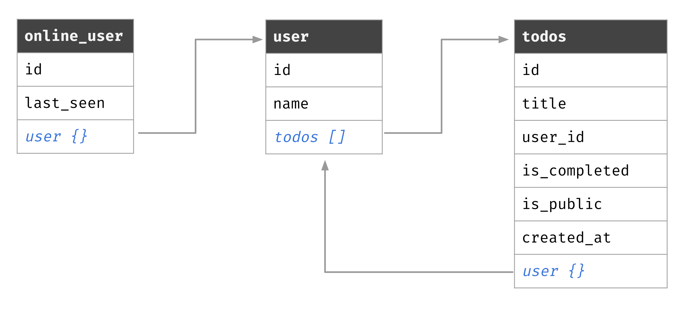

<a name="graphiql"></a>
## Try out GraphQL queries
For this tutorial we've set up a GraphQL API for you. The most common
way to browse a GraphQL API is to use GraphiQL. GraphiQL is a tool
built by Facebook, (pronounced "graphical") that makes it easy to explore
any GraphQL API.

When you connect GraphiQL to a GraphQL endpoint, it
queries the server for its GraphQL schema and gives you a UI to browse
and test queries, and that powers its amazing autocomplete!


Tools like GraphiQL make GraphQL APIs really easy
to use and integrate APIs in your app without requiring
external documentation tools.

You can access the GraphiQL for this realtime todo app tutorial here:
[learn.hasura.io/graphql/graphiql](https://learn.hasura.io/graphql/graphiql)

When you work with a GraphQL API in a project you will almost always
use a tool like GraphiQL to explore and test your GraphQL queries.

## Basic GraphQL query

1. Open GraphiQL at: [learn.hasura.io/graphql/graphiql](https://learn.hasura.io/graphql/graphiql). 
   You'll have to login to get an auth token to query the API. In a real-world scenario
   your GraphQL APIs will be protected.
2. You'll see a URL, and headers that contain the auth
   token that will be sent along with your GraphQL query.
3. Now, paste this GraphQL query in the GraphiQL window

```graphql
 query {
   users {
     name
   }
 }
 ```

4. Hit `ctrl + enter` or `cmd + enter` (mac) or click on the ▶️ icon to run the GraphQL query
5. On the right, you should see a list of users by their names that are in the system!

__Try it out in GraphiQL__

Recall that there is no magic here! The hosted GraphiQL app is sending a GraphQL query string
to the server at the given endpoint with the HTTP headers. The server then sends the response
that you see on the right hand side.

## Fetching "graphs"

Our todo app has users, todos and information about users that are currently online.
This is what our API "schema" looks like:



As you can see, it is a "graph" like schema where all the 3 models are linked to each other.

Let's try making queries that fetch different slices of our data from the overall "graph".

### Fetch users and their todos

This GraphQL query will fetch all the users and their publicly visible todos:

```graphql
 query {
   users {
     name
     todos {
       title
     }
   }
 }
```

__Try it out in GraphiQL__


### Fetch online users and their profile information

This GraphQL query will fetch all the currently online users
and their profile information (which is just their name for now):

```graphql
 query {
   online_users {
     last_seen
     user {
       name
     }
   }
 }
```

<!-- [//]: # TODO: -->
__Try it out in GraphiQL__


## Adding parameters (arguments) to GraphQL queries

In most API calls, you usually use paramters. For example, to specify what data you're fetching.
If you're familiar with making `GET` calls, you would have used a query parameter. For example,
to fetch only 10 todos you might have made this API calls: `GET /api/todos?limit=10`.

The GraphQL query analog of this is *arguments* that you can attach to a "field".

### Basic argument: Fetch 10 todos

This GraphQL query will fetch 10 todos and not all of them.

```graphql
query {
  todos(limit: 10) {
    id
    title
  }
}
```

<!-- [//]: # TODO: -->
__Try it out in GraphiQL__

The most important bit to check here is `limit: 10`. GraphQL servers will provide a list of
arguments that can be used in `()` next to specific fields. In our case, we are using
Hasura for creating the GraphQL backend which provides filter, sort and pagination arguments.
The GraphQL server or API that you use, might provide a different set of arguments that can be used.

### Multiple arguments on multiple fields: Fetch 1 user and 5 most recent todos for each user

```graphql
query {
  users (limit: 1) {
    id
    name
    todos(order_by: {created_at: desc}, limit: 5) {
      id
      title
    }
  }
}
```

Notice that we are passing arguments to different fields. This GraphQL query reads as:
> Fetch users (with limit 1), and their todos (ordered by descending creation time, and limited to 5).

<!-- [//]: # TODO: -->
__Try it out in GraphiQL__

<a name="query-variables"></a>
## GraphQL variables: Passing arguments to your queries dynamically

This is great, but we still have a problem. If we want to create a query
where we are fetching data with arguments that are provided dynamically, we'd have to 
create the entire query string again.

This is what we don't want to do:

```javascript
var limit = getMaxTodosFromUserInput();
var query = "query { todos (limit: " + limit.toString() + ") {id title} }";
```

Thankfully, we don't ever have to do this! GraphQL variables are extra variables
that you can send in a query so that the "arguments" can be provided dynamically!

## Fetch $limit number of todos

This is what our GraphQL query would look like:
```graphql
query ($limit: Int!) {
  todos(limit: $limit) {
    id
    title
  }
}
```

In addition to the query above, we send a variables object:
```json
{
   "limit": 10
}
```

Now instead of sending just the query to the GraphQL server, from our client
we'll send both the query and the variables. The GraphQL server will use the
variable in the right place in the query automatically for us!

Let's try this out in GraphiQL:
1. Head to GraphiQL
2. Write out this query
3. Scroll to the bottom of the page, where you see a smaller panel "Query Variables"
4. Add the query variable as a JSON object

<!-- [//]: # TODO: -->
__Try it out in GraphiQL__

## Summary

- You can now make GraphQL queries
- You know how to pass arguments to your GraphQL queries
- You know how to make your arguments dynamic by using query variables

Next, let's look at writing data and not just fetching data!
